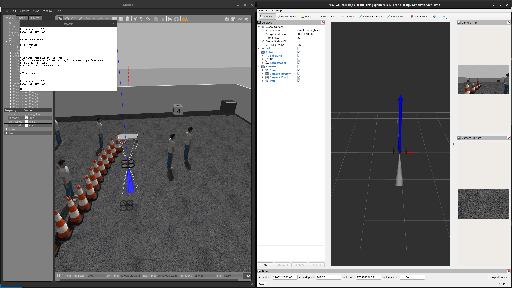
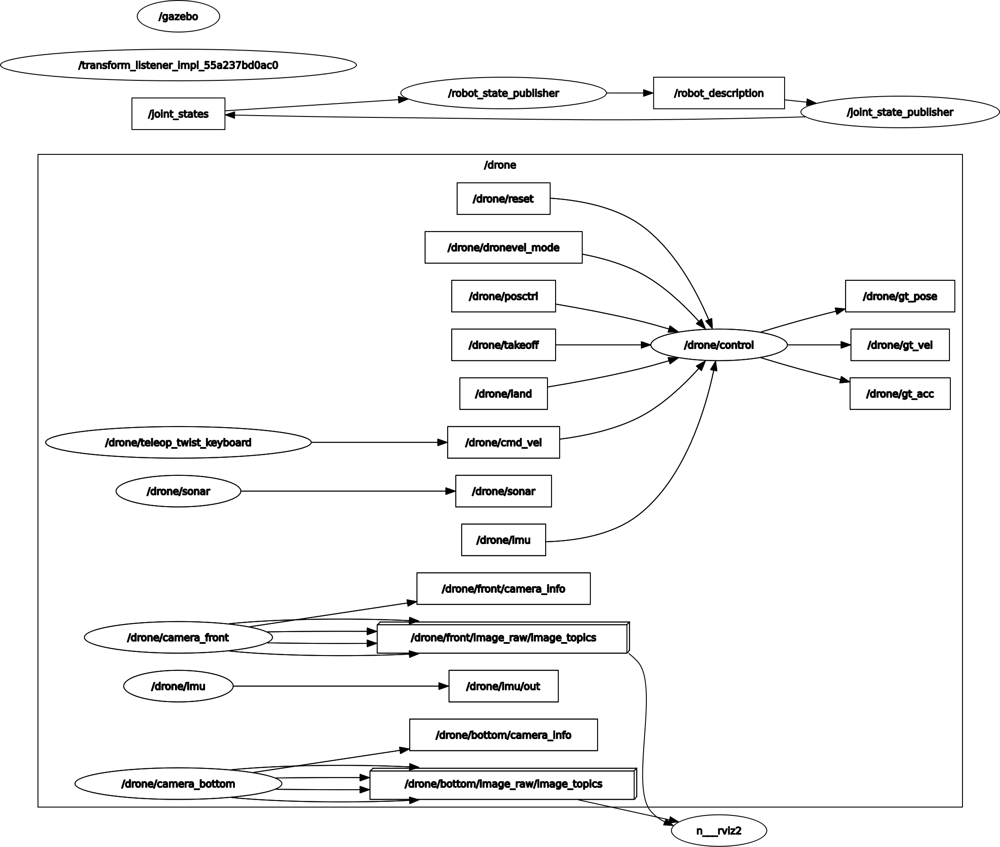

# Come utilizzare
## Prerequisiti
- Ubuntu 22.04 LTS - Va bene anche virtualizzato
- Docker 
- ! Non Serve installare ROS direttamente, viene fatto tutto dallo script di configurazione dell'ambiente di sviluppo !

## Come Installare docker per Ubuntu 22.04
1.  ```bash
    for pkg in docker.io docker-doc docker-compose docker-compose-v2 podman-docker containerd runc; do sudo apt-get remove $pkg; done
    ```

2.  ```bash
    # Add Docker's official GPG key:
    sudo apt-get update
    sudo apt-get install ca-certificates curl
    sudo install -m 0755 -d /etc/apt/keyrings
    sudo curl -fsSL https://download.docker.com/linux/ubuntu/gpg -o /etc/apt/keyrings/docker.asc
    sudo chmod a+r /etc/apt/keyrings/docker.asc

    # Add the repository to Apt sources:
    echo \
    "deb [arch=$(dpkg --print-architecture) signed-by=/etc/apt/keyrings/docker.asc] https://download.docker.com/linux/ubuntu \
    $(. /etc/os-release && echo "$VERSION_CODENAME") stable" | \
    sudo tee /etc/apt/sources.list.d/docker.list > /dev/null
    sudo apt-get update
    ```
3.  ```bash
    sudo apt-get install docker-ce docker-ce-cli containerd.io docker-buildx-plugin docker-compose-plugin
    ```
## Come Costruire l'ambiente di sviluppo:
1.  ```bash
    # download della cache per i modelli !
    ./cache.sh
    ```
2.  ```bash
    # build del container
    sudo ./local_build.sh
    ```
3.  ```bash
    sudo ./local_run.sh
    ```

## Connessione al container per e avviamento del nodo di controllo
1.  ```bash
    sudo ./run_remote.sh
    ```

2.  ```bash
    cd /home/{USER}/sjtu_drone_control
    ```

3.  ```bash
    ./run.sh
    ```

## Speigazione delle finestre avviate
1. Mondo Gazebo
2. RViz
3. Telecomando Remoto
4. APF - Controllo autonomo

## Selezionare il waypoint
- Premere 1 o 2 o 3

## Avviare l'autonomia del drone
- Premere g

#
# 
# 
# 
# 
# 
# sjtu_drone
[](https://github.com/NovoG93/sjtu_drone/actions/workflows/CI_CD.yml) [](https://github.com/NovoG93/sjtu_drone/actions/workflows/CI_CD.yml) [](https://github.com/NovoG93/sjtu_drone/actions/workflows/CI_CD.yml)

sjtu_drone is a quadrotor simulation program forked from [tum_simulator](http://wiki.ros.org/tum_simulator), developed using ROS + Gazebo.

The acronym 'sjtu' stands for Shanghai Jiao Tong University. This package has been used in the past for testing algorithms for the [UAV contest at SJTU](http://mediasoc.sjtu.edu.cn/wordpress)

# Requirements

- This package is tested with ROS 2 (Ubuntu 22.04) and Gazebo 11.
- This Version in test using Docker please refer to the docker manual to install it

# --------------------------------------------------------------
# Custom Version
- This version was built by Giovanni Rasera 143395@spes.uniud.it
- github: [cetriolino](https://github.com/GiovanniRaseraF)
- This is specific for ros2 humble
## Build -> Use
### Install
```bash
    sudo bash local_build.sh
```
### Use
```bash
    sudo bash local_run.sh
```
# IMPORTANT !!!
- When you modify code you need to rebuild the docker !!!
```bash
    # modfy some code .............
    sudo bash local_build.sh
    sudo bash local_run.sh
```

# Issues
- Build is very slow, im working on local cache to speedup build

# --------------------------------------------------------------

# Downloading and building

```
cd ~/git && git clone git@github.com:NovoG93/sjtu_drone.git -b ros2
cd ~/ros2_ws/src && ln -s ~/git/sjtu_drone
cd .. && rosdep install -r -y --from-paths src --ignore-src --rosdistro $ROS_DISTRO && colcon build --packages-select-regex sjtu*
```

To use the playground.world file (as depicted below) make sure to install the common gazebo models, for more see the [Readme in sjtu_drone_description](./sjtu_drone_description/README.md).

## Drone Topics

### Sensors
The folowing sensors are currently implemented:
- ~/front/image_raw [__sensor_msgs/msg/Image__]
- ~/bottom/image_raw [__sensor_msgs/msg/Image__]
- ~/sonar/out [__sensor_msgs/msg/Range__]
- ~/imu/out [__sensor_msgs/msg/Imu__]
- ~/gps/nav [__sensor_msgs/msg/NavSatFix__]
- ~/gps/vel [__geometry_msgs/msg/TwistStamped__]
- ~/joint_states [__sensor_msgs/msg/JointState__]

### Control 
The following control topics are currently subscribed to:
- ~/cmd_vel [__geometry_msgs/msg/Twist__]: Steers the drone
- ~/land [__std_msgs/msg/Empty__]: Lands the drone
- ~/takeoff [__std_msgs/msg/Empty__]: Starts the drone
- ~/posctrl [__std_msgs/msg/Bool__]: Toggling between position control (give drone a pose via cmd_vel) and normal control (only use cmd_vel)
- ~/dronevel_mode [__std_msgs/msg/Bool__]: Toggeling between velocity and tilt control in normal control mode.
- ~/cmd_mode [__std_msgs/msg/Bool__]: Publishes the current control mode (position or normal control)
- ~/state [__std_msgs/msg/Int8__]: Publishes the current state of the drone (0: landed, 1: flying, 2: hovering)
- ~/reset [__std_msgs/msg/Empty__]: Resets the drone

### Ground Truth
The following ground truth topics are currently published:
- ~/gt_acc [__geometry_msgs/msg/Twist__]: ground truth acceleration
- ~/gt_pose [__geometry_msgs/msg/Pose__]: ground truth pose
- ~/gt_vel [__geometry_msgs/msg/Twist__]: ground truth velocity


## Configure Plugin

The `plugin_drone` plugin is used to control the drone. It can be configured using the following parameters:

```yaml
# ROS namespace for the drone. All topics and tf frames will be prefixed with this namespace.
namespace: /simple_drone

# Proportional gain for roll and pitch PID controllers. Controls the drone's response to roll and pitch errors.
rollpitchProportionalGain: 10.0
# Differential gain for roll and pitch PID controllers. Helps to reduce overshoot and improve stability.
rollpitchDifferentialGain: 5.0
# Maximum absolute value for roll and pitch control outputs, limiting maximum tilt angle.
rollpitchLimit: 0.5

# Proportional gain for yaw PID controller. Determines how strongly the drone responds to yaw position errors.
yawProportionalGain: 2.0
# Differential gain for yaw PID controller. Dampens the rate of change of yaw error for smoother rotation.
yawDifferentialGain: 1.0
# Maximum absolute value for yaw control output, limiting rotational rate.
yawLimit: 1.5

# Proportional gain for horizontal velocity PID controllers. Controls response to changes in horizontal velocity.
velocityXYProportionalGain: 5.0
# Differential gain for horizontal velocity PID controllers. Controls acceleration/deceleration in horizontal plane.
velocityXYDifferentialGain: 2.3
# Maximum limit for horizontal velocity control output, restricting maximum horizontal speed.
velocityXYLimit: 2

# Proportional gain for vertical velocity PID controller. Influences response to altitude changes.
velocityZProportionalGain: 5.0
# Integral gain for vertical velocity PID controller. Set to zero, indicating no error integration over time.
velocityZIntegralGain: 0.0
# Differential gain for vertical velocity PID controller. Helps control vertical acceleration and deceleration.
velocityZDifferentialGain: 1.0
# Maximum limit for vertical velocity control output. Negative value may indicate special control scenario or error.
velocityZLimit: -1

# Proportional gain for horizontal position PID controllers. Controls response to horizontal displacement errors.
positionXYProportionalGain: 1.1
# Differential gain for horizontal position PID controllers. Set to zero, meaning no rate of change consideration.
positionXYDifferentialGain: 0.0
# Integral gain for horizontal position PID controllers. Set to zero, indicating no cumulative error correction.
positionXYIntegralGain: 0.0
# Maximum limit for horizontal position control output, restricting maximum correctional force for horizontal errors.
positionXYLimit: 5

# Proportional gain for vertical position PID controller. Influences altitude adjustment in response to height errors.
positionZProportionalGain: 1.0
# Differential gain for vertical position PID controller. Smooths adjustment of altitude changes.
positionZDifferentialGain: 0.2
# Integral gain for vertical position PID controller. Set to zero, indicating no error integration over time.
positionZIntegralGain: 0.0
# Maximum limit for vertical position control output. Negative value could indicate special requirement or error.
positionZLimit: -1

# Maximum force that the drone can exert, limiting maximum thrust to prevent aggressive maneuvers.
maxForce: 30
# Parameter for adding small random noise to drone's motion. Set to zero, indicating no small noise addition.
motionSmallNoise: 0.00
# Parameter for drift noise. Set to zero, meaning no drift noise is being applied.
motionDriftNoise: 0.00
# Time interval for updating motion drift noise. Relevant only if `motionDriftNoise` is non-zero.
motionDriftNoiseTime: 50
```

# Run

## Docker

1. Start the docker container:   
`bash run_docker.sh`
2. Connect to docker container to takeoff / land drone:   
    1. `docker container exec -it sjtu_drone 'ros2 topic pub /drone/takeoff std_msgs/msg/Empty {} --once'`
    1. `docker container exec -it sjtu_drone 'ros2 topic pub /drone/land std_msgs/msg/Empty {} --once'`

## ROS 2 Source Installation

1. Start gazebo, spawn drone, open teleop in xterm window, and open rviz:   
`ros2 launch  sjtu_drone_bringup sjtu_drone_bringup.launch.py`
2. Takeoff drone:   
`ros2 topic pub /drone/takeoff std_msgs/msg/Empty {} --once`
3. Move drone: (use teleop window)
4. Land drone:   
`ros2 topic pub /drone/land std_msgs/msg/Empty {} --once`

You should see the following:



For more see the following image:



# Known Issues
* No ROS communication between docker container and host


# Projects using this repository

- [Drona🤖✈️](https://github.com/Gaurang-1402/Drona): is a drone control software that enables drones to be operated using Large Language Models, emphasizing ease of use and accessibility. It's designed to interact with real-world scenarios, specifically in fields like agriculture and disaster relief, where drones can be used for tasks like monitoring crop health or aiding in search and rescue operations, all controlled through simplified, multilingual commands.
- [Window Washing Drone](https://github.com/ayushchakra/window-washing-drone): is a project that aims to automate the process of window washing using a drone. 
- [ChatDrones](https://github.com/Gaurang-1402/ChatDrones): is a project that merges Large Language Models with drone control, enabling users to operate drones through simple natural language commands. It includes a user-friendly web application, allowing for easy input of commands in multiple languages and control of drone movements such as takeoff, landing, and directional navigation.


